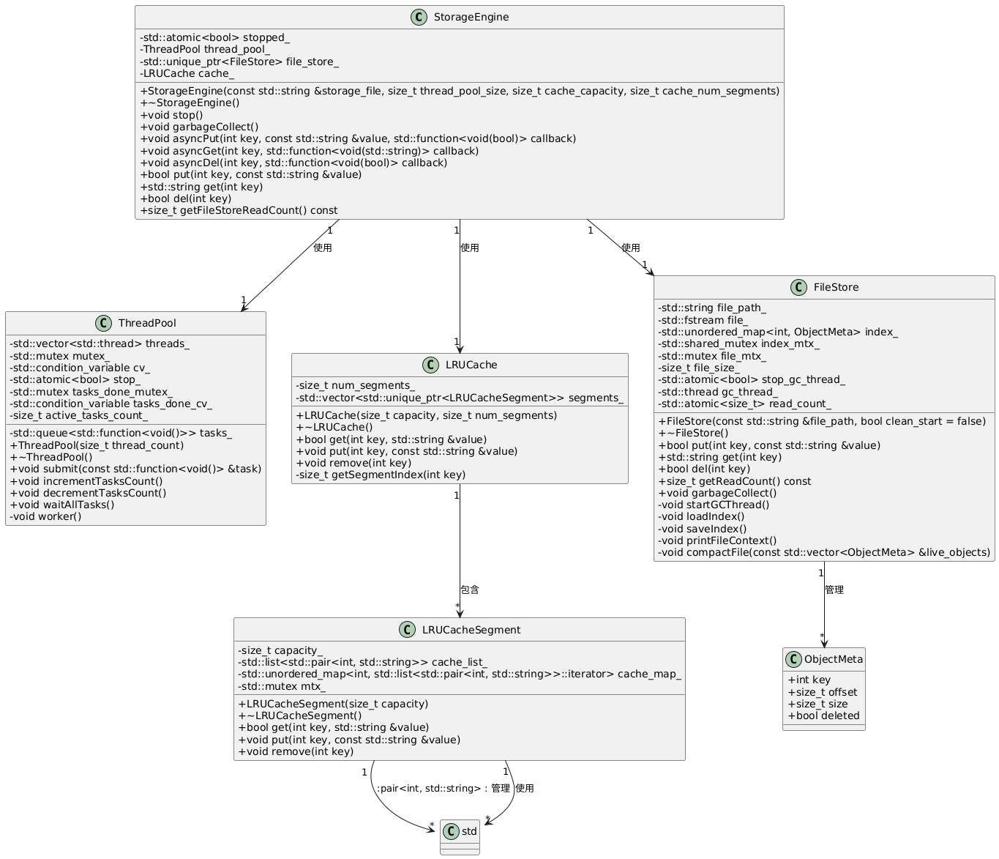

# Linux环境高级编程大作业：小对象存储引擎

## 作业要求

目标:完成支持K/V形式的小对象存储功能，提供包括对象的GET/PUT/DEL的多线程事务操作。
形式要求:基于C/C++，提供上述接口，并封装为SO库。
实现约束:
1)所有小对象需统一存储在一个大文件中，设计内存缓存对小对象进行CACHE，Key为整型，Value支持任意数据结构;
2)参考文件系统模型设计大文件的物理对象存储模型，元数据与对象数据寻址方法;
3)需支持多线程环境，采用多生产者多消费者模型;完成持续读写压力测试，运行时间不低于12小时，插入对象不低于1千万个，观察CPU，内存，磁盘开销，并将压测分析输出到报告中。
提交内容:可编译的源码(存储引擎和测试程序源代码)，可执行文件和SO库文件;设计文档(包括模块框架设计，重要流程图(主要是GET/PUT/DEL接口流程)，核心数据结构，运行时截图(操作相关结果)。

## 项目架构



## 项目组织

```
.
├── include            # 头文件目录
│   ├── cache.h        # 缓存相关头文件
│   ├── engine.h       # 引擎相关头文件
│   ├── file_store.h   # 文件存储相关头文件
│   └── thread_pool.h  # 线程池相关头文件
├── src                # 源代码目录
│   ├── cache.cpp      
│   ├── engine.cpp     
│   ├── file_store.cpp 
│   └── thread_pool.cpp
├── build              # 构建输出目录
├── tests              # 测试代码目录，存有单元测试和压力测试的代码
├── lib                # 库文件目录，存放.so文件
├── bin                # 可执行文件目录
├── docs               # 文档目录
├── charts             # 图表目录
├── logs               # 日志目录
├── tmp                # 临时文件目录
├── data               # 数据目录
└── Makefile           # Makefile 构建脚本
```

## 项目构建

构建整个项目，将在bin下生成所有的可执行文件：

```bash
make
```

单元测试（使用了**Google test**框架）：

```bash
make tests
```

对单元测试中代码覆盖率进行分析（使用工具 **gcov** 和 **lcov**）：

```bash
lcov --capture --directory . --output-file coverage.info --exclude '/usr/*'
genhtml coverage.info --output-directory ./docs/coverage_report --ignore-errors source
```

压力测试

```bash
make stress
```

对压力测试进行数据分析的脚本：

```bash
./run_stress_test.sh 
```

生成的日志文件记录在logs目录下，运行下面的脚本对数据进行分析并把可视化的图表输出在charts目录：

```bash
python3 log_analysis.py 
```

生成gprof性能报告：

```bash
gprof ./bin/stress_test gmon.out > docs/gprof_analysis_report.txt
```

gprof中的调用图转为图像：

```bash
gprof2dot -f prof docs/gprof_analysis_report.txt -o docs/gprof_call_graph.dot
dot -Tpng docs/gprof_call_graph.dot -o charts/gprof_call_graph.png
```

注：因github上传文件大小不能超过100M的限制，long_stress_test_db.dat及long_stress_test_db.dat.idx未能上传，可以自行运行压力测试并生成。
